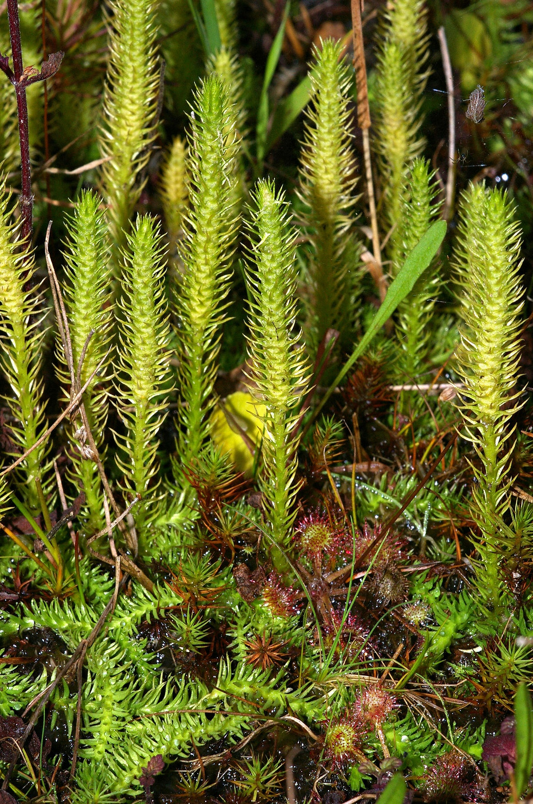

## Department of Lycopods, or Lycopodiophyta

Lycopods belong to the group of the most ancient representatives of the terrestrial flora. At the end of the Paleozoic era, especially in the Carboniferous period, lycopods reached their greatest development and diversity. At that time, the ancestors of modern lycopods, called sigillaria, lepidodendrons or scale trees, covered large expanses of our planet.

Lepidodendrons had powerful columnar main stems - trunks, the height of which reached 30 m, and the diameter of the trunks was 2–3 m at the base.

The trunks of young plants were densely covered with very long awl-shaped leaves. In some species, the length of such leaves could be up to 1 m with a width of more than 1 cm.As the plant grew, the leaves alternately and gradually died off and fell off from the bottom up, and leaf scars with bunches of leaf traces and remnants of airborne tissue remained on the trunks. Such leaf traces were similar to large scales, perhaps that is why the fossil representatives of the ancient lyre got such a common name - lepidodendrons, which is translated from Latin as "scales-trees".
 
At the beginning of the Mesozoic era, due to climate change, all large lycopods begin to die out, they are replaced by ancient gymnosperms more adapted to new ecological conditions. Small herbaceous species of lycopods, surviving under the canopy of more competitive gymnosperms, survived their dominance and successfully adapted to later life in new ecosystems, where flowering plants became the predominant plants.

The memory of the mighty ancient lycopods remained in the seams of coal, which is the fossilized remains of lepidodendrons-scaled trees and other tree ferns and horsetails (see picture of the textbook, p. 59). And, currently burning coal, in the form of heat or light from power plants, we receive the energy of those sunbeams of eras far from us, which these plants "conserved" in the process of photosynthesis more than 300 million years ago.

One thousand four hundred species of modern lycopods, which have very little resemblance to their giant ancestors, are evergreen perennial grasses, less often dwarf shrubs. Very rarely, they raise their cambium-free shoots higher than one meter. With the help of creeping shoots, lycopsids reproduce well and quickly vegetatively. In this case, shoots growing many meters in length create the impression of a plant creeping or floating on the soil. It is no coincidence that this large department of ancient spore-bearing plants was named Plow-like.
 

 
All shoots of lycopods are rather densely covered with small simple leaves, the shape of which can be oval, subulate, thorn-shaped, linear, lanceolate. Such leaves are located on shoots of different types, either alternately, or opposite, or whorled.

All lycopods never form flowers - they are spore plants. Sporangia - organs of sporulation - are formed in the axils of the leaves or on their inner surfaces. Spores can mature for a rather long time, getting enough sleep, they germinate and give rise to gametophytes only on moist soils.

Lycopods, being indispensable components of many ecosystems, need protection and protection. When harvesting spores, which were previously widely used and are now used in medicine and in some industries, it is recommended to carefully cut off only spore-bearing parts of plants, the so-called spikelets, in no case damage or pull out the rest of the plant.

Attention! It has long been noticed that vertebrate herbivores do not eat lycopes. Scientists have found that some species of lyre, such as the ram, contains a poison similar in effect to the strong poison of curare.

## Rod Plown (Lycopodium)

Species of this genus are widespread throughout the world, meeting from the zone of tropical rainforests to the tundra zone. In Russia, mainly in coniferous forests, as well as in mountain and lowland tundra, 5 species of lycopes grow.

Interesting is the emergence of the Latin name of the genus - Lycopodium. This name was introduced into botany by the German biologist J. T. Tabernemontan in the 16th century.

Studying the structural features of the club-shaped lyre, this scientist found some similarity between the harsh tips of the shoots of the lyre with the paw of an animal, in particular a wolf. And as a synonym for the German name I used the word lycopodium, which literally means "wolf's paw".

Clavate and annual lymphoid are the most common species in Russian forests.

In the club-shaped lyceum, the main axis is a creeping stem, from which lateral lodging shoots, most often with limited growth, extend. Shoots are covered with very small linear subulate leaves no more than 6 mm long. Thin, poorly developed adventitious roots grow down from the shoots, with the help of which all shoots take root.

